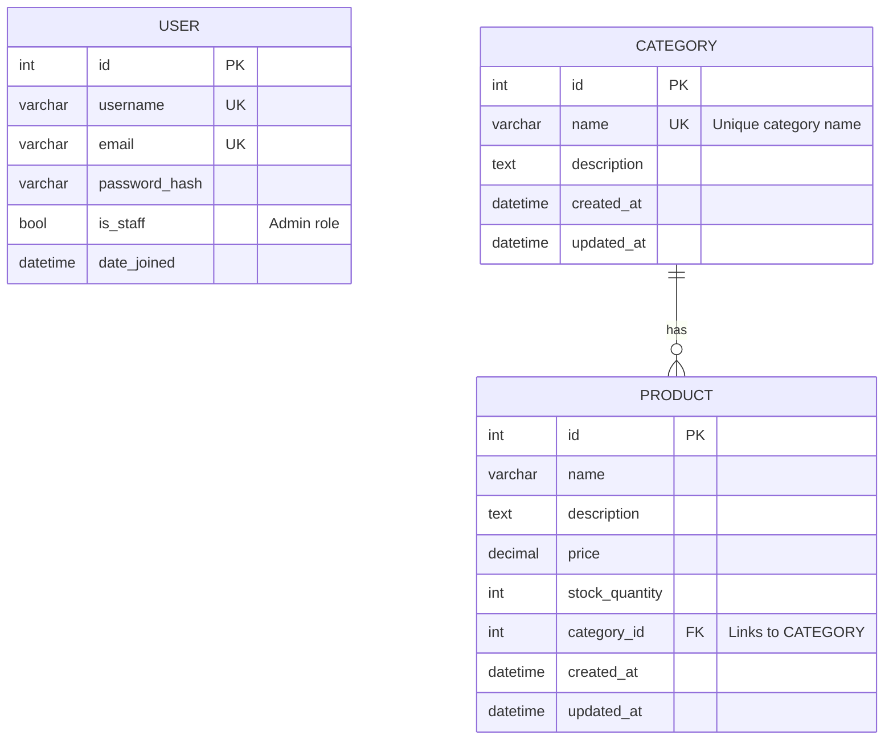

# E-commerce Backend

## 1. Project Requirements

This section outlines the functional and non-functional requirements for the e-commerce product catalog backend system.

### Functional Requirements

These define _what_ the system must do.

**Product & Category Management** 🛍️

- **Admin Role:** Admins must have full **CRUD** (Create, Read, Update, Delete) capabilities for products and categories.

**User Management & Authentication** 🔒

- **User Accounts:** The system must support user registration and login.
- **JWT Authentication:** All protected API endpoints must be secured using JSON Web Tokens (JWT).
- **Profile Management:** Authenticated users must be able to view and update their own profile information.

**Product Discovery** 🔍

- **Filtering:** Users must be able to filter the product list by **category**.
- **Sorting:** Users must be able to sort products by **price** (required). The system should also be designed to allow sorting by **name** and **date added**.
- **Pagination:** API endpoints that return a list of products must paginate the results to handle large datasets efficiently.
- **Search:** The system should include a basic search functionality to find products by **name**.

**User Roles & Permissions** 👥

- **Admin:** Full control over product and category data.
- **Authenticated User (Shopper):** Can manage their profile, view products, and perform shopping-related actions (details to be defined).
- **Unauthenticated User (Guest):** Can only browse/view products.

**API Documentation** 📄

- The system must have auto-generated, interactive API documentation using **Swagger/OpenAPI**.
- This documentation must be hosted and publicly accessible for frontend developers.

### Non-Functional Requirements

These define _how_ the system should operate.

**Technology Stack** 💻

- **Backend Framework:** Django
- **Database:** PostgreSQL
- **Authentication Mechanism:** JWT
- **Testing Framework:** Pytest

**Performance** ⚡

- **Database Optimization:** The database schema must be designed for high performance, utilizing **indexing** on frequently queried columns (e.g., product price, category foreign key).

**Code Quality & Maintainability** ✨

- The codebase must be clean, well-documented, and easily maintainable.
- The project repository must have a logical and well-organized structure.

**Security** 🛡️

- User authentication must be implemented securely, following best practices for JWT handling (e.g., token expiration, secure storage).

**DevOps & CI/CD** 🚀

- **Version Control:** Git must be used, with a commit message convention (e.g., `feat:`, `fix:`, `docs:`).
- **Environments:** The project must support three distinct environments: **testing**, **staging**, and **production**.
- **Configuration:** Environment variables must be managed using `.env` files for local development and **GitHub Secrets** for CI/CD pipelines.
- **Continuous Integration (CI):** A GitHub Actions workflow must be triggered on every push to:
  1.  Run the test suite using **Pytest**.
  2.  Build a **Docker image** of the application.
  3.  Push the Docker image to **Docker Hub**.
- **Continuous Deployment (CD):**
  1.  Upon successful CI, the application will be automatically deployed to the **staging** environment.
  2.  A mechanism will be in place to deploy from staging to the **production** environment.

---

## 2\. Database Design

### Entities and Relationships

Based on the project requirements, we can identify three primary entities: **User**, **Category**, and **Product**.

- **User**: Represents an individual interacting with the system. Django's built-in `User` model is a perfect fit, providing fields for username, email, password, and roles/permissions (`is_staff` for admins).
- **Category**: Represents a classification for products (e.g., "Electronics," "Books").
- **Product**: Represents an item available for sale.

The key relationship is between `Product` and `Category`:

- A **Category** can have many **Products**.
- A **Product** belongs to exactly **one Category**.
- This defines a **one-to-many** relationship.

### Entity-Relationship Diagram (ERD)

Here is an ERD in Mermaid.js format, which will render directly in a GitHub Wiki. It visualizes the entities, their key attributes, and the relationship between them.



\*\*

### Database Schema (3NF)

The following SQL `CREATE TABLE` statements represent the proposed database schema. This design is in **Third Normal Form (3NF)** because:

1.  It meets 1NF (all values are atomic) and 2NF (no partial dependencies on a composite key).
2.  It meets 3NF by eliminating transitive dependencies. For example, a product's category name is not stored in the `products` table; instead, we store a `category_id` foreign key, ensuring that non-key attributes depend only on the primary key.

<!-- end list -->

```sql
-- Represents users, leveraging Django's built-in auth model.
-- This is a simplified representation.
CREATE TABLE users (
    id SERIAL PRIMARY KEY,
    username VARCHAR(150) NOT NULL UNIQUE,
    email VARCHAR(254) NOT NULL UNIQUE,
    password VARCHAR(128) NOT NULL,
    is_staff BOOLEAN NOT NULL DEFAULT FALSE, -- Determines admin status
    is_active BOOLEAN NOT NULL DEFAULT TRUE,
    date_joined TIMESTAMPTZ NOT NULL DEFAULT NOW()
);

-- Represents product categories
CREATE TABLE categories (
    id SERIAL PRIMARY KEY,
    name VARCHAR(255) NOT NULL UNIQUE,
    description TEXT,
    created_at TIMESTAMPTZ NOT NULL DEFAULT NOW(),
    updated_at TIMESTAMPTZ NOT NULL DEFAULT NOW()
);

-- Represents products
CREATE TABLE products (
    id SERIAL PRIMARY KEY,
    name VARCHAR(255) NOT NULL,
    description TEXT,
    price DECIMAL(10, 2) NOT NULL,
    stock_quantity INT NOT NULL DEFAULT 0,
    category_id INT NOT NULL,
    created_at TIMESTAMPTZ NOT NULL DEFAULT NOW(),
    updated_at TIMESTAMPTZ NOT NULL DEFAULT NOW(),
    CONSTRAINT fk_category
        FOREIGN KEY(category_id)
        REFERENCES categories(id)
        ON DELETE RESTRICT -- Prevents deleting a category if products are linked to it
);
```

### Performance & Indexing Considerations

To ensure fast query performance for filtering, sorting, and searching, the following indexes are recommended:

- **`products.category_id`**: An index should be created on this foreign key. This is critical for speeding up filtering products by category. Django automatically creates this index for `ForeignKey` fields.
- **`products.price`**: An index on this column is essential for efficient sorting by price.
- **`products.name`**: To support the "search by name" feature, an index on the `name` column will significantly improve the performance of `LIKE` or full-text search queries.
- **`categories.name`**: The `UNIQUE` constraint on this column will automatically create an index, ensuring fast lookups by category name.

---

## 3. System Actors and User Roles

This section defines the different types of users (actors) who will interact with the e-commerce backend and outlines their specific roles and permissions.

### 1. Administrator (Admin)

- **Description**: The **Administrator** is a superuser with full control over the system's data. This role is intended for internal staff responsible for managing the product catalog and overall system health. In Django, this user will have the `is_staff` flag set to `True`.
- **Interactions & Permissions**:
  - **Product Management**: Can **Create, Read, Update, and Delete (CRUD)** any product in the system.
  - **Category Management**: Can **CRUD** any product category.
  - **User Oversight**: Can view a list of all users (though not typically responsible for day-to-day user management in this scope).

### 2. Authenticated User (Shopper)

- **Description**: An **Authenticated User** is anyone who has successfully registered and logged into the system. They are the primary consumers of the e-commerce platform.
- **Interactions & Permissions**:
  - **Product Discovery**: Can **view** (Read) lists of products and individual product details.
  - **Filtering & Sorting**: Can use all available **filtering** (by category) and **sorting** (by price, name, date) functionalities.
  - **Search**: Can **search** for products by name.
  - **Profile Management**: Can **view and update** their own user profile information (e.g., change their password, update their email).
  - **Authentication**: Can **log in** to gain access to their account and **log out** to end their session.

### 3. Unauthenticated User (Guest)

- **Description**: An **Unauthenticated User** is any visitor who has not logged into the system. Their access is limited to browsing the public-facing product catalog.
- **Interactions & Permissions**:
  - **Product Discovery**: Can **view** (Read) lists of products and individual product details.
  - **Filtering & Sorting**: Can use all available **filtering** and **sorting** functionalities.
  - **Search**: Can **search** for products by name.
  - **Restricted Access**: **Cannot** access any authenticated routes, such as a user profile page. They must register or log in to proceed with actions like making a purchase (which is outside the current scope but an implied next step).

---

## 4. User Stories

### Product & Category Management (Admin)

- **As an** Administrator, **I want to** create a new product with a name, description, price, and stock quantity, **so that** I can add new items to the catalog.
- **As an** Administrator, **I want to** view a list of all existing products, **so that** I can have an overview of the entire catalog.
- **As an** Administrator, **I want to** update the details of an existing product, **so that** I can correct errors or change product information.
- **As an** Administrator, **I want to** delete a product from the catalog, **so that** I can remove discontinued or unavailable items.
- **As an** Administrator, **I want to** create a new product category, **so that** I can organize products effectively.
- **As an** Administrator, **I want to** assign a product to a specific category, **so that** users can find it when browsing that category.
- **As an** Administrator, **I want to** update or delete existing categories, **so that** I can manage the store's taxonomy.

### User Authentication & Profile Management

- **As an** Unauthenticated User, **I want to** register for a new account using my email and a password, **so that** I can become a shopper.
- **As an** Authenticated or Unauthenticated User, **I want to** log in with my credentials, **so that** I can access my account and protected features.
- **As an** Authenticated User, **I want to** log out of the system, **so that** I can securely end my session.
- **As an** Authenticated User, **I want to** view and update my profile information (e.g., email, password), **so that** I can keep my account details current.

### Product Discovery (All Users)

- **As a** User (Guest or Shopper), **I want to** view a paginated list of all available products, **so that** I can browse the catalog without being overwhelmed.
- **As a** User, **I want to** filter the product list by category, **so that** I can find items of a specific type.
- **As a** User, **I want to** sort the visible products by price, **so that** I can find items within my budget.
- **As a** User, **I want to** sort the visible products by name or date added, **so that** I have multiple ways to organize my view.
- **As a** User, **I want to** search for a product by its name, **so that** I can quickly find a specific item I'm looking for.

### API & System Quality (Developer/Admin)

- **As a** Developer, **I want to** have comprehensive API documentation generated from the code, **so that** frontend developers can easily integrate with the backend.
- **As a** Developer, **I want** the system to have a CI/CD pipeline, **so that** code changes are automatically tested, built, and deployed, ensuring reliability and speed.

---

## 5\. Project Structure and Development Plan

### High-Level Architecture

The system will be a **modular monolithic API**. We will use Django and the Django REST Framework (DRF) to build a backend service that exposes a set of RESTful API endpoints. The architecture will be organized into distinct Django "apps," where each app is responsible for a specific domain of functionality.

- **Core App**: Will handle project-wide settings, configurations for different environments (development, staging, production), and root URL routing.
- **Users App**: Responsible for all user-related logic, including registration, JWT-based authentication, and profile management.
- **Catalog App**: Manages all product and category data, including models, serializers, and the API views for CRUD operations, filtering, sorting, and pagination.

### Proposed Project Structure

Here is a recommended directory structure for the Django project. This layout promotes separation of concerns and scalability.

```
ecommerce_backend/
├── .github/
│   └── workflows/
│       ├── ci.yml          # Runs tests, builds Docker image, pushes to Docker Hub
│       └── cd.yml          # Deploys to staging and production environments
│
├── apps/                   # Directory for all Django apps
│   ├── users/              # Handles user management and authentication
│   │   ├── migrations/
│   │   ├── models.py
│   │   ├── serializers.py
│   │   ├── views.py
│   │   ├── urls.py
│   │   └── tests/          # Tests for the users app
│   │
│   └── catalog/            # Handles products and categories
│       ├── migrations/
│       ├── models.py
│       ├── serializers.py
│       ├── views.py
│       ├── urls.py
│       └── tests/          # Tests for the catalog app
│
├── core/                   # Project-level configuration
│   ├── settings/           # Split settings for different environments
│   │   ├── __init__.py
│   │   ├── base.py
│   │   ├── development.py
│   │   ├── staging.py
│   │   └── production.py
│   ├── urls.py
│   └── wsgi.py
│
├── .env.example            # Example environment variables file
├── .gitignore
├── Dockerfile              # To containerize the application
├── manage.py
└── requirements.txt        # Python package dependencies
```

### Development Plan: Sprints

We will break the project into four manageable sprints. Each sprint represents a milestone with clear goals and deliverables. (Assuming a sprint duration of 1-2 weeks).

---

#### **Sprint 1: Project Foundation & User Authentication**

- **Goal**: To set up the project infrastructure, establish a database connection, and implement the core user authentication system.
- **Deliverables**:
  1.  A new Django project initialized with the proposed directory structure.
  2.  PostgreSQL database connected and configured for all environments.
  3.  The `users` app created with a custom User model (if needed) or using Django's default.
  4.  API endpoints for user registration (`/api/users/register/`) and login (`/api/users/token/`) using JWT.
  5.  A protected endpoint (e.g., `/api/users/me/`) to test token authentication.
  6.  Initial Pytest setup with tests covering registration and login.
  7.  Basic CI workflow in GitHub Actions that runs the test suite on every push.

---

#### **Sprint 2: Admin Catalog Management (CRUD)**

- **Goal**: To build the data models for the product catalog and implement the admin-only CRUD APIs.
- **Deliverables**:
  1.  The `catalog` app with `Product` and `Category` models and database migrations.
  2.  Admin-only API endpoints for full CRUD operations on `/api/products/` and `/api/categories/`.
  3.  Permissions configured to ensure only administrators can access these endpoints.
  4.  Comprehensive test suite for all CRUD functionalities, including permission checks.
  5.  CI pipeline updated to include catalog tests.

---

#### **Sprint 3: Public Product Discovery APIs**

- **Goal**: To implement the public-facing APIs that allow all users to browse and find products.
- **Deliverables**:
  1.  Publicly accessible `GET` endpoints for `/api/products/` and `/api/products/{id}/`.
  2.  Backend logic for filtering products by `category_id`.
  3.  Backend logic for sorting products by `price`, `name`, and `created_at`.
  4.  Pagination implemented on the product list endpoint.
  5.  A basic search feature implemented on the `name` field of products.
  6.  Pytest suite expanded to cover all filtering, sorting, pagination, and search scenarios.

---

#### **Sprint 4: API Documentation & Full CI/CD Pipeline**

- **Goal**: To finalize the project by adding comprehensive API documentation and building the complete CI/CD pipeline for automated deployments.
- **Deliverables**:
  1.  Swagger/OpenAPI documentation integrated into the project, providing an interactive UI for all endpoints.
  2.  The GitHub Actions CI workflow is finalized to build and push a Docker image to Docker Hub.
  3.  A CD workflow in GitHub Actions that automatically deploys the new image to the **staging** environment.
  4.  A manual trigger or similar mechanism to promote a build from staging to the **production** environment.
  5.  All environment variables configured in GitHub Secrets.
  6.  Final review of code quality, tests, and documentation.

---
